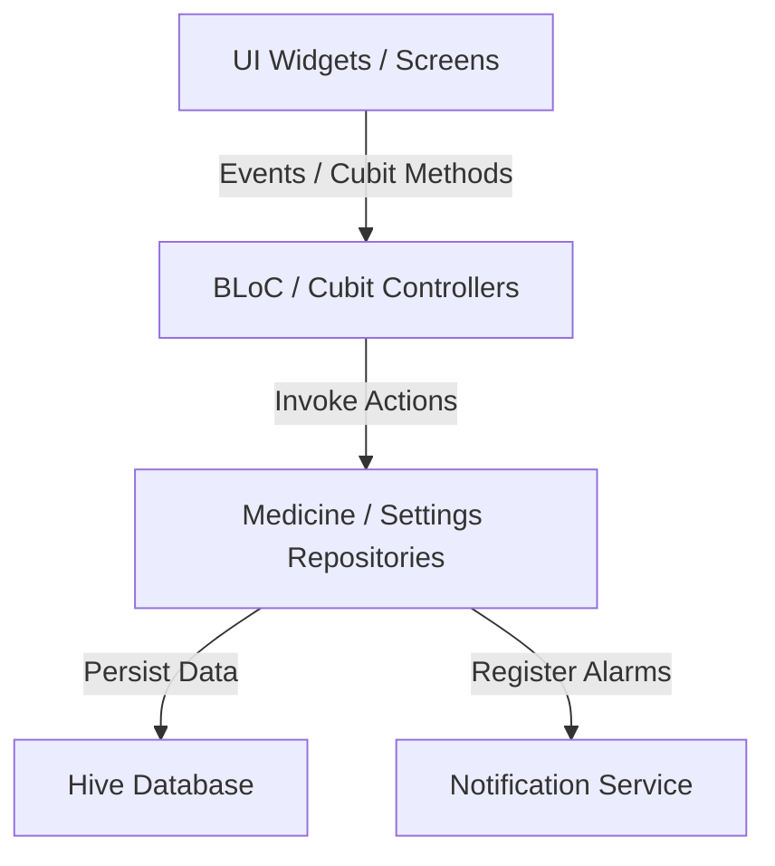

# 💊 PillMinder — Medicine Reminder App

A production-focused, offline-first medicine reminder application built with Flutter. PillMinder is designed to provide reliable medication scheduling, local notifications, dose tracking, and automatic reminder recovery across application closures and device restarts.

---

## 🚀 Key Features

* **Offline-First & Local Storage**: Powered by **Hive**, the app persists all medicines, schedules, user settings, and dose logs locally on the device with zero network dependencies.
* **Automatic Occurrence Generation**: Calculates individual dose occurrences dynamically. For example, a medicine active for 7 days with 3 doses per day yields exactly 21 occurrences, each independently trackable.
* **Decoupled Snapshots for Historical Accuracy**: When occurrences are generated, the dose strength (e.g. `500 mg • 1 Tablet`) and food instructions are stored as snapshots. Editing a medicine's strength later leaves historical logs unchanged (e.g., past logs still show `500 mg` while future ones show `1000 mg`).
* **Ongoing Medication Strategy**: For medicines with no end date, a **14-day rolling scheduling window** is implemented. This keeps the local database bounded and respects OS notification limits (like the iOS 64-notification threshold).
* **Local Notifications with Actions**: Delivers alarms when the app is foregrounded, backgrounded, closed, or when the phone is locked. Notifications feature interactive action buttons:
  * **✓ Taken**: Logs the dose as taken with the actual action timestamp.
  * **⏳ Snooze**: Temporarily silences the alarm and reschedules it based on user preference (5, 10, 15, or 30 minutes).
  * **❌ Skip**: Logs the dose as skipped.
* **Device Restart Recovery**: Listens to Android boot completion triggers (`RECEIVE_BOOT_COMPLETED`) and executes a startup sync service that reconciles persisted schedules with platform notification registries, automatically rescheduling any missing alerts.
* **Active Sound Previews**: Users can select and preview custom synthesized reminder alarms (`alarm1.wav`, `alarm2.wav`, and `alarm3.wav`) in the settings using the `audioplayers` package.
* **Dynamic Notification Channels**: Workarounds Android's notification channel caching limitations by creating dynamic channel IDs based on the active sound file, ensuring audio changes apply instantly.
* **Premium Micro-Animations**:
  * **3-Second Splash Screen**: Features pulse and scale-up brand animations on launch before cross-fading to the dashboard.
  * **Success Spring Animation**: Uses a dual-interval elastic animation to spring a checkmark into view upon successfully adding or editing a medicine.
  * **Auto-Centering Date Strip**: The horizontal calendar date strip automatically scrolls to center today's date on load and centers any other tapped dates smoothly.

---

## 🏗️ Architecture & Project Structure

The project is structured following **Clean Architecture** principles to separate concerns, make features modular, and ensure business logic is highly testable.

```text
lib/
├── core/
│   ├── models/          # Persistent Hive Database Entities
│   ├── theme/           # App design system, custom themes, and gradients
│   ├── services/        # Hive initialization and Local Notifications engine
│   ├── repositories/    # Repo interfaces and database coordination
│   └── utils/           # Mathematical occurrence generator and date helpers
│
└── features/
    ├── dashboard/       # Schedule summary, statistics panel, date strip, search
    ├── medicine/        # Form logic for adding, editing, pausing, and deleting
    ├── reminder/        # Dedicated alert screen opened from notifications
    ├── history/         # Chronological treatment logs with status/date filters
    └── settings/        # Preferences panel (snooze, vibration, sound selector)
```

### 🔄 Data & State Flow


---

## 💾 Database Schema (Hive Models)

1. **`MedicineModel` (Type ID: 0)**: Represents the blueprint of a medicine.
   * `id`, `name`, `description`, `type`, `strength`, `startDate`, `endDate` (nullable), `doses` (list), `isActive`, `createdAt`, `updatedAt`.
2. **`DoseModel` (Type ID: 1)**: Represents a dose time and size template.
   * `id`, `time` (HH:mm), `quantity` (double), `unit` (e.g. Tablet, ml), `foodInstruction`.
3. **`DoseOccurrenceModel` (Type ID: 2)**: Represents an individual scheduled dose.
   * `id`, `medicineId`, `doseId`, `scheduledAt`, `dose` (frozen snapshot of quantity+strength), `foodInstruction` (frozen snapshot), `status` (`pending`, `taken`, `missed`, `skipped`), `actionAt`, `snoozedUntil`, `createdAt`.
4. **`AppSettingsModel` (Type ID: 3)**: Stores user preferences.
   * `sound`, `vibration` (boolean), `defaultSnoozeMinutes`, `notificationsEnabled` (boolean).

---

## 🔄 Reminder Lifecycle & Reconciliation

### 1. Happy Path
```mermaid
sequenceSummary
    Create Medicine -> Generate Occurrences -> Save to Hive -> Register Notifications -> Alert Triggers -> Action (Taken/Skipped) -> Update Hive Status -> Cancel Notification -> Persist Logs
```

### 2. Reconciliation on Startup
When the application starts, it performs a synchronization pass:
1. **Missed Sync**: Scans all `pending` dose occurrences in Hive. If their scheduled time has passed and they were not actioned, the status is automatically transitioned to `missed`.
2. **Ongoing Sync**: Scans active medicines without an end date. If the latest generated occurrence is less than 7 days in the future, it automatically generates and schedules the next 14-day block.
3. **Stale Cleanups**: Deleting or pausing a medicine cancels all future scheduled notifications and deletes future pending occurrences, retaining past history logs intact.

---

## 🛠️ How to Get Started

### Prerequisites
* Flutter SDK (compatible with v3.x stable channels)
* Android SDK (API Level 26+ recommended for notifications)
* Xcode (for iOS builds)

### 1. Install Dependencies
Clone the repository and run pub get to install all required packages (`flutter_bloc`, `hive_flutter`, `flutter_local_notifications`, `timezone`, `audioplayers`, etc.):
```bash
flutter pub get
```

### 2. Generate Database Adapters
Generate the Hive type adapter files (`.g.dart`) using build_runner:
```bash
flutter pub run build_runner build --delete-conflicting-outputs
```

### 3. Run the Application
Start the project on your connected device or emulator:
```bash
flutter run
```

---

## 🧪 Testing & Verification

The project includes unit tests located in `test/medicine_reminder_test.dart` to verify logic.

### Scenarios Tested
* **Dose Calculations**: Asserts that a 7-day range with 3 doses/day generates exactly 21 occurrences.
* **Historical Decoupling**: Verifies that occurrence snapshots freeze strength values correctly at creation time.
* **Bounds Alignment**: Checks that starting dates in the future are respected correctly.
* **Dashboard calculations**: Validates stats calculations (Total, Taken, Pending, Missed, Skipped) from occurrence lists.

Run the test suite using:
```bash
flutter test
```
